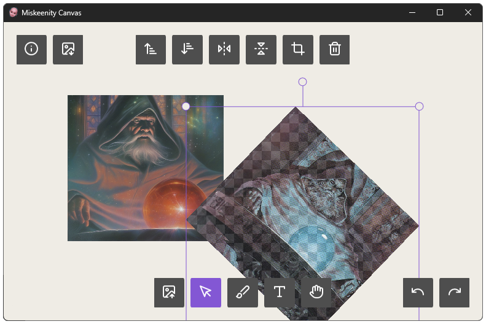

# Miskeenity Canvas

Cross platform 2d infinite canvas app inspired by [dingboard.com](https://dingboard.com/).

**Web version available to try here (chromium broswers only): https://sava41.github.io/miskeenity-canvas/**


## Requirements:
- CMake 3.28 or later
- Python 3.8 or newer
- cpp compiler

## Build for Desktop:

```bash
> cmake -B build -DCMAKE_BUILD_TYPE=<type>
> cmake --build build
```

currently there are issues building on macos

## Build WASM/HTML version via Emscripten (Linux, macOS)

Setup the emscripten SDK as described here:

https://emscripten.org/docs/getting_started/downloads.html#installation-instructions

```bash
> git clone https://github.com/emscripten-core/emsdk.git
> cd emsdk
> git pull
> ./emsdk install latest
> ./emsdk activate latest
> cd ..

> emsdk/upstream/emscripten/emcmake cmake . -B embuild -DCMAKE_BUILD_TYPE=<type>
> cmake --build embuild
```

## Planned Features
- layer masking
- canvas history (undo/redo)
- copy/paste
- keyboard shortcuts
- Rendering imporvements (anti-aliasing, mip-maps, better font rendering)

<p align="center">
	
</p>

