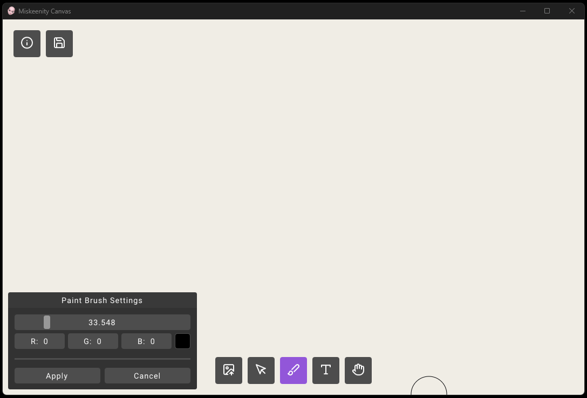
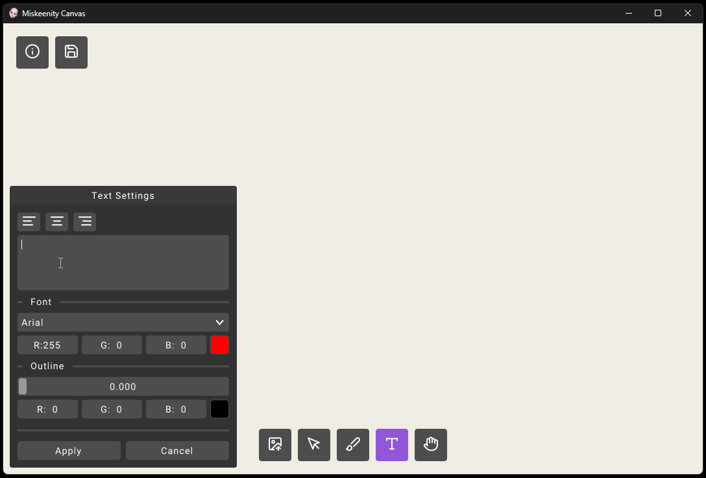
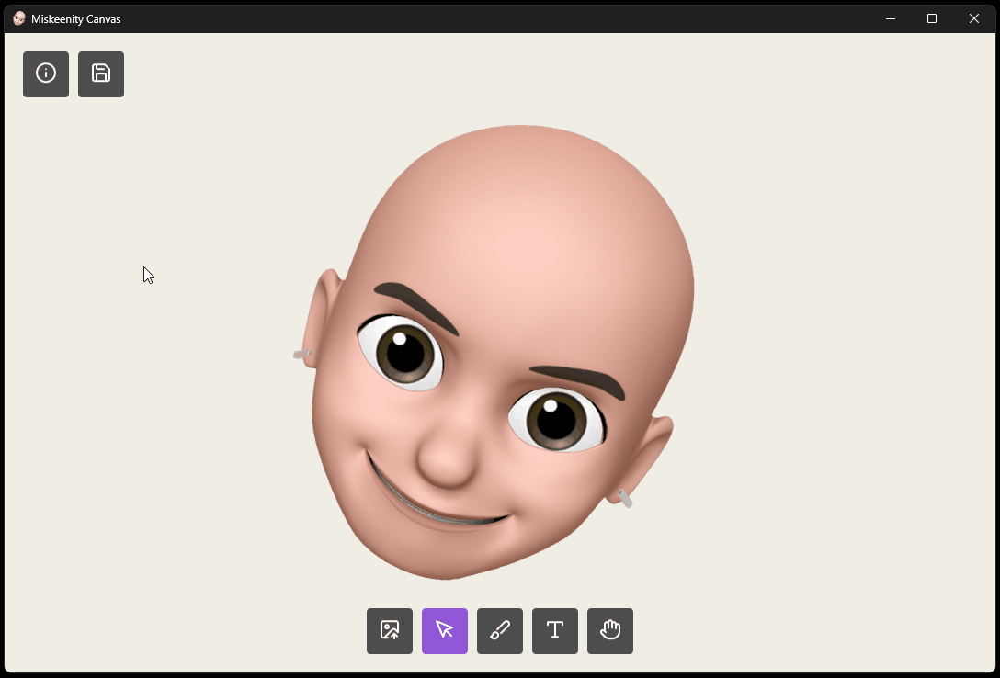
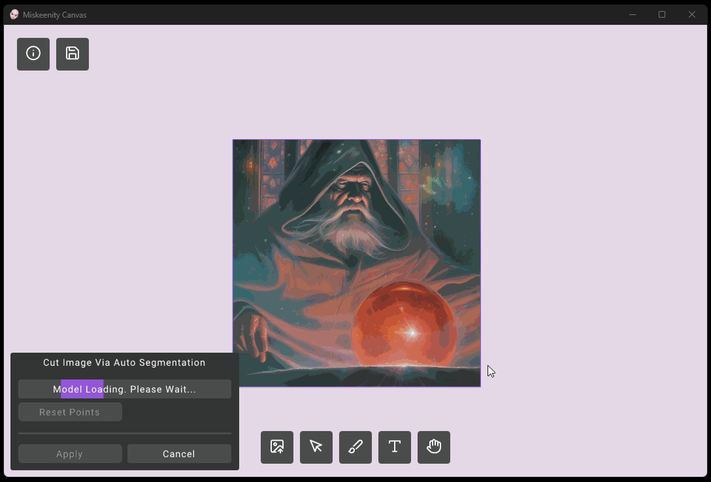
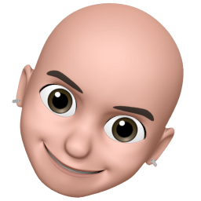

# Miskeenity Canvas

Cross platform 2d infinite canvas app inspired by [dingboard.com](https://dingboard.com/).

**Web version available to try here (chromium browsers only): https://sava41.github.io/miskeenity-canvas/**

## Features

**Paint**


**Add Text**


**Add and Edit Images**


**AI Image Segmentation (Desktop Only)**


## Requirements:
- CMake 3.28 or later
- Python 3.8 or newer
- cpp compiler

## Build for Desktop:

```bash
> cmake -B build -DCMAKE_BUILD_TYPE=<type>
> cmake --build build
```

currently there are issues building on macos

### Using SAM for Image Segmentation

To use AI image segmentation you need to download the models and place them in the miskeenity canvas executable folder. These are included in the release downloads or can be generated from the official SAM repository. `sam_vit_h_4b8939.onnx` can be exported using the steps found here https://github.com/facebookresearch/segment-anything#onnx-export. The preprocess model `sam_preprocess.onnx` needs to be exported using an unofficial script such as the one found [here](resources/scripts/export_pre_model.py)
Before using the models also make sure the ONNX runtime dynamic library is present in executable folder.

## Build WASM/HTML version via Emscripten (Linux, macOS)

Setup the emscripten SDK as described here:

https://emscripten.org/docs/getting_started/downloads.html#installation-instructions

```bash
> git clone https://github.com/emscripten-core/emsdk.git
> cd emsdk
> git pull
> ./emsdk install latest
> ./emsdk activate latest
> cd ..

> emsdk/upstream/emscripten/emcmake cmake . -B embuild -DCMAKE_BUILD_TYPE=<type>
> cmake --build embuild
```

## Planned Features
- pixel-perfect selection
- copy/paste/clipboard
- keyboard shortcuts
- rendering improvements (anti-aliasing, better font rendering)

<p align="center">
	
</p>

